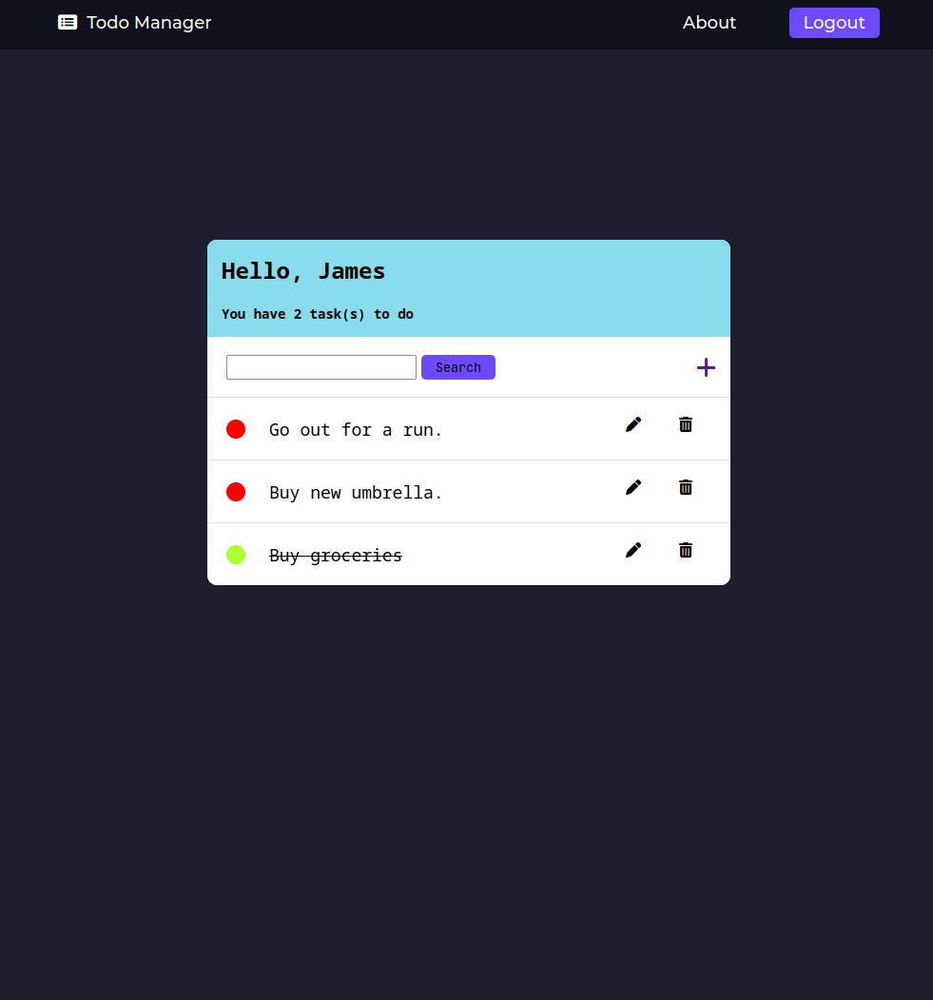
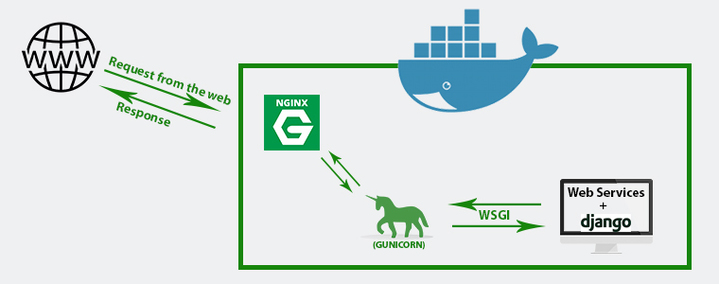

# To-Do List with Django
Created a To-Do List Application with Django. Users can create an account to create, read, update, and delete different tasks. Purpose is for learning Django framework and hosting an application. Link to project [here](https://todo.jamesyy.info/).

## Preview

## Application Tech Stack
- Front-end: HTML/CSS
- Back-end: Postgresql
- Framework: Django
- Others: AWS EC2 (Ubuntu VPS), Docker, Letsencrypt (SSL certs), Nginx-proxy (proxy manager)
## Application Hosting Structure

The Django application is Dockerized with Gunicorn (to connect Django to Nginx), nginx-proxy (for reverse proxy), and Postgres (for database) with a structure similar to the diagram below. This container is deployed on an EC2 instance on AWS with a domain pointing to that instance. The container also includes Letsencrypt (using nginx-proxy-letsencrypt) for SSL certificates for HTTPS. Postgres database inside container rather than using AWS RDS as it is just a simple application. 

## Resources
[Docker+Django Guide](https://testdriven.io/blog/dockerizing-django-with-postgres-gunicorn-and-nginx/#static-files)