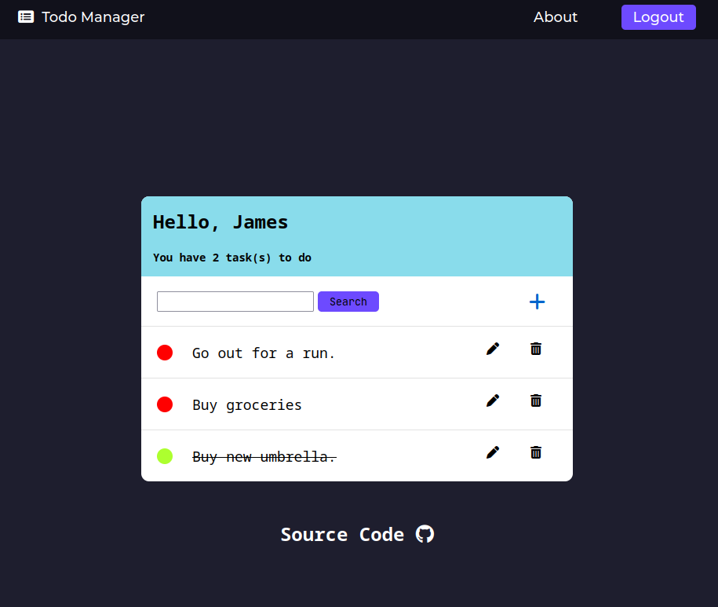

# To-Do List with Django
Created a To-Do List Application with Django. Users can create an account to create, read, update, and delete different tasks. The application is hosted on an Amazon EC2 instance using Docker, Nginx, and Gunicorn. The application data is stored on a Postgresql database in the container. Link to project [here](#).

## Preview

## Structure

The Django application is Dockerized with Gunicorn, Nginx, and Postgres with a structure similar to the diagram above. This container is deployed on an EC2 instance on AWS with a domain pointing to that instance. The container also includes Letsencrypt for SSL certificates. 

## Resources
[Docker+Django Guide](https://testdriven.io/blog/dockerizing-django-with-postgres-gunicorn-and-nginx/#static-files)